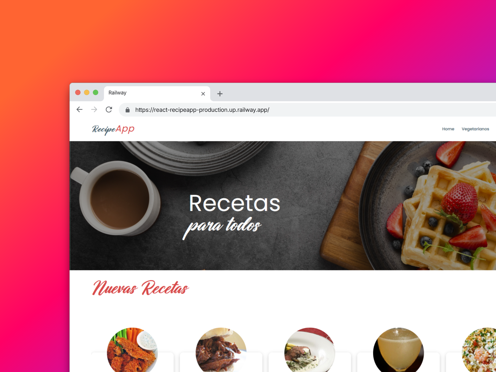

> Puedes ver la muestra en vivo en [react-recipeapp-production.up.railway.app](https://react-recipeapp-production.up.railway.app).

# Recipe App

Aplicación web construída con React, TypeScript y Vite para explorar recetas destacadas, nuevas creaciones y tips culinarios con una interfaz visualmente atractiva.

## Instalación y ejecución

### Prerrequisitos
- Node.js 18+ y npm 9+ (o pnpm/yarn si prefieres).
- Git para clonar el repositorio.

### Pasos
1. Clona el proyecto:
   ```bash
   git clone <tu-fork-o-este-repo>
   cd recipe_app
   ```
2. Instala dependencias:
   ```bash
   npm install
   ```
3. Levanta el entorno de desarrollo con recarga en caliente:
   ```bash
   npm run dev
   ```
4. Genera la build optimizada (opcional):
   ```bash
   npm run build
   npm run preview
   ```

## Scripts disponibles

| Comando        | Descripción                                   |
| -------------- | --------------------------------------------- |
| `npm run dev`  | Servidor Vite con HMR.                        |
| `npm run build`| Compila la aplicación para producción.        |
| `npm run lint` | Ejecuta las reglas de ESLint configuradas.    |
| `npm run preview` | Sirve la build generada para validación.  |

## Previews

| Hero principal | Cards destacadas | Sección de servicios |
| -------------- | ---------------- | -------------------- |
|  |  | 
